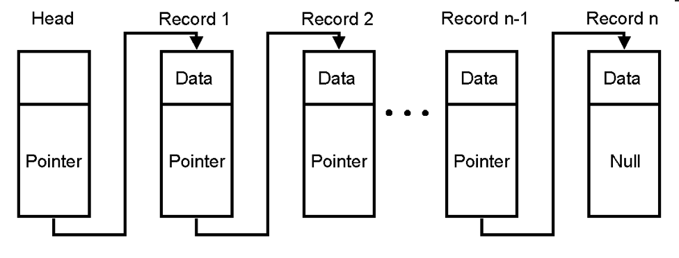

# Blockchain

## Introduction
A blockchain in the simplest of terms is literally a chain of blocks. 
Each block is connected to the previous block through 

_Source: [BlockGeeks] https://blockgeeks.com/wp-content/uploads/2017/08/image3.png

Above you can see what a blockchain looks like. Each block contains a hash of all the data contained within the previous node and its own relevant data.

## The Problem
You have come up with a new 'Simple_Coin' which you want to implement using blockchain technology. Unfortunately for the users (and fortunately for you) you have adopted a framework which all of the mining power is centralised.

To ensure that the mining method is fully working and deterministic you want to make sure that even if simple_coin is implemented again the hashes of the blocks are similar given that the input data does not change. You decide that the blocks should be empty to make your job easier as well.

Your goal is to implement the method in 'simple_coin.py' to verify your assumption.

NOTE: Blocks should be empty

### Project Layout

You need only to make changes to `simple_coin.py`, please make sure to familiarize yourselves with the layout of the entire directory however. The roles of the other files are as follows:

* `block.py`: contains the block object class which will act as individual blocks in the blockchain
* `blockchain.py`: contains the blockchain implementation. Make sure you familiarize yourself with how it works.
* `simple_coin.py`: contains one method which you will need to implement. the method should be able to mine the requesite number of blocks on the blockchain
* `test.py`: a script to help run all the other tests.
* `test_simple_coin.py`: testing scripts built on the `unittest` module. Each test ensures the validity of your implementation
